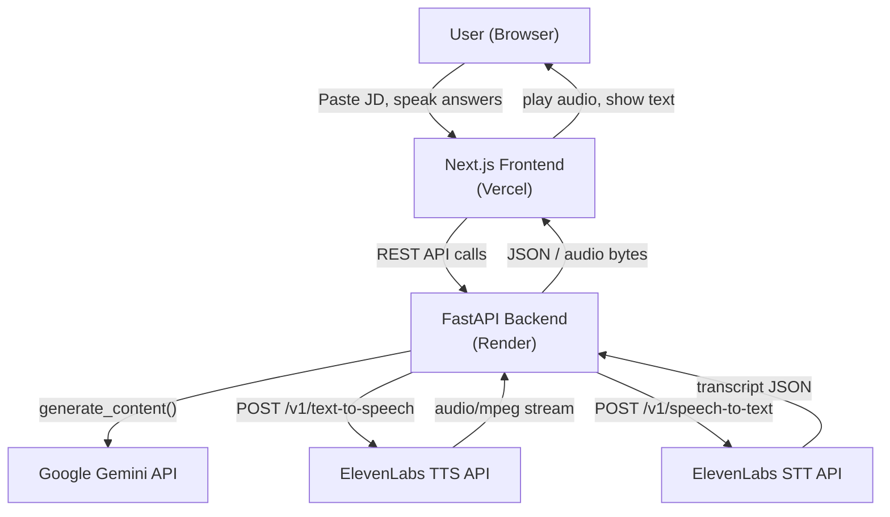

# PrepMate — AI Mock Interviewer: Design

## Overview

PrepMate is a voice-driven mock interview web application. A user pastes a job description, the backend uses Google Gemini to generate five role-specific interview questions, and the frontend walks the user through each question using ElevenLabs TTS to speak the question aloud. The user answers by speaking; ElevenLabs STT transcribes the answer. Gemini then generates a contextual follow-up question. After all questions are answered, Gemini produces a scored debrief with feedback.

The system is stateless (no database, no auth). All session state lives in the browser for the duration of the interview. The backend is a thin orchestration layer that calls external AI APIs and returns structured data.

### Key Design Decisions

- **Stateless backend**: Session state (questions, answers, transcripts) is held in the frontend and sent back to the backend only when needed (e.g., for debrief generation). This avoids a database entirely.
- **Audio handled in the browser**: The frontend records audio via the MediaRecorder API and sends the audio blob to the backend, which proxies it to ElevenLabs STT. TTS audio is streamed back as binary from the backend and played directly in the browser.
- **Gemini Flash**: `gemini-1.5-flash` is used for all LLM calls — it is fast, cheap, and supports structured JSON output via `response_mime_type: application/json`.
- **ElevenLabs Scribe v2**: Used for STT (`POST /v1/speech-to-text`). Returns a plain-text transcript.
- **ElevenLabs Flash v2.5**: Used for TTS (`POST /v1/text-to-speech/{voice_id}`) with the `eleven_flash_v2_5` model for low latency.

---

## Architecture



### Request Flow

1. **Start session**: `POST /api/session/start` — frontend sends JD text; backend returns 5 questions as JSON.
2. **Get TTS audio**: `POST /api/tts` — frontend sends question text; backend returns audio bytes (mp3).
3. **Transcribe answer**: `POST /api/stt` — frontend sends recorded audio blob; backend returns transcript string.
4. **Get follow-up**: `POST /api/followup` — frontend sends original question + transcript; backend returns one follow-up question.
5. **Get debrief**: `POST /api/debrief` — frontend sends all Q&A pairs; backend returns scored debrief JSON.

---

## Components and Interfaces

### Backend (FastAPI)

#### `POST /api/session/start`

```
Request:
  { "job_description": string }

Response:
  { "questions": string[] }   // exactly 5 questions
```

#### `POST /api/tts`

```
Request:
  { "text": string, "voice_id": string? }

Response:
  Content-Type: audio/mpeg
  Body: raw mp3 bytes
```

#### `POST /api/stt`

```
Request:
  Content-Type: multipart/form-data
  Field: "audio" (audio/webm or audio/wav blob)

Response:
  { "transcript": string }
```

#### `POST /api/followup`

```
Request:
  { "question": string, "answer": string }

Response:
  { "followup": string }
```

#### `POST /api/debrief`

```
Request:
  {
    "job_description": string,
    "qa_pairs": [
      { "question": string, "answer": string, "followup": string?, "followup_answer": string? }
    ]
  }

Response:
  {
    "overall_score": number,        // 0–100
    "summary": string,
    "feedback": [
      {
        "question": string,
        "score": number,            // 0–10
        "strengths": string[],
        "improvements": string[]
      }
    ]
  }
```

### Frontend (Next.js)

| Component | Responsibility |
|---|---|
| `JobDescriptionPage` | Text area for JD input, "Start Interview" button |
| `InterviewPage` | Orchestrates the question/answer loop |
| `QuestionCard` | Displays current question text, plays TTS audio |
| `AudioRecorder` | Wraps MediaRecorder API; records and sends audio blob |
| `TranscriptDisplay` | Shows live transcript after STT |
| `DebriefPage` | Renders scored debrief with per-question feedback |
| `useInterviewSession` | React hook holding all session state |

#### `useInterviewSession` state shape

```typescript
interface InterviewSession {
  jobDescription: string;
  questions: string[];
  currentIndex: number;           // 0–4 for main questions, 5 for follow-ups
  answers: AnswerRecord[];
  phase: "idle" | "loading" | "asking" | "recording" | "processing" | "followup" | "debrief";
}

interface AnswerRecord {
  question: string;
  transcript: string;
  followup?: string;
  followupTranscript?: string;
}
```

---

## Data Models

### Gemini Prompt Contracts

All Gemini calls use `response_mime_type: "application/json"` for structured output.

#### Question Generation Prompt

```
System: You are an expert technical interviewer. Given a job description, generate exactly 5 
interview questions that assess the candidate's fit for the role. Return a JSON object with 
a single key "questions" containing an array of 5 strings.

User: <job_description>
```

Expected response schema:
```json
{ "questions": ["string", "string", "string", "string", "string"] }
```

#### Follow-up Generation Prompt

```
System: You are an expert interviewer. Given an interview question and the candidate's answer, 
generate one insightful follow-up question that probes deeper. Return JSON: {"followup": "string"}.

User: Question: <question>\nAnswer: <answer>
```

#### Debrief Generation Prompt

```
System: You are an expert interview coach. Evaluate the candidate's performance across all 
interview questions. Return a JSON object matching this schema:
{
  "overall_score": <0-100>,
  "summary": "<string>",
  "feedback": [
    { "question": "<string>", "score": <0-10>, "strengths": ["<string>"], "improvements": ["<string>"] }
  ]
}

User: Job Description: <jd>\n\nInterview Q&A:\n<formatted qa_pairs>
```

### ElevenLabs API Contracts

**TTS**: `POST https://api.elevenlabs.io/v1/text-to-speech/{voice_id}`
- Headers: `xi-api-key: <key>`
- Body: `{ "text": string, "model_id": "eleven_flash_v2_5" }`
- Response: `audio/mpeg` binary stream

**STT**: `POST https://api.elevenlabs.io/v1/speech-to-text`
- Headers: `xi-api-key: <key>`
- Body: `multipart/form-data` with `model_id=scribe_v2` and `file=<audio blob>`
- Response: `{ "text": string, ... }`

### Environment Variables

| Variable | Used by |
|---|---|
| `GEMINI_API_KEY` | Backend — Gemini SDK |
| `ELEVENLABS_API_KEY` | Backend — ElevenLabs TTS + STT |
| `ELEVENLABS_VOICE_ID` | Backend — default TTS voice |
| `NEXT_PUBLIC_API_URL` | Frontend — backend base URL |


---

## Correctness Properties

*A property is a characteristic or behavior that should hold true across all valid executions of a system — essentially, a formal statement about what the system should do. Properties serve as the bridge between human-readable specifications and machine-verifiable correctness guarantees.*

### Property 1: Question generation always returns exactly 5 questions

*For any* non-empty job description string, calling the question generation logic SHALL return a list of exactly 5 non-empty question strings.

**Validates: Requirements — Core flow step 2**

### Property 2: Follow-up generation always returns a non-empty question

*For any* (question, answer) pair where both are non-empty strings, calling the follow-up generation logic SHALL return a non-empty string.

**Validates: Requirements — Core flow step 5**

### Property 3: Debrief response always has a valid structure and scores within range

*For any* non-empty list of Q&A pairs (up to 5), calling the debrief generation logic SHALL return a response where:
- `overall_score` is an integer in the range [0, 100]
- `feedback` is a non-empty list with one entry per Q&A pair
- each `feedback[i].score` is a number in the range [0, 10]
- `summary` is a non-empty string

**Validates: Requirements — Core flow step 6**

---

## Error Handling

### Backend

| Scenario | Handling |
|---|---|
| Empty or whitespace-only job description | Return `400 Bad Request` with `{ "error": "job_description is required" }` |
| Gemini API error / timeout | Return `502 Bad Gateway` with `{ "error": "LLM service unavailable" }` |
| Gemini returns malformed JSON | Retry once; if still malformed, return `502` |
| ElevenLabs TTS error | Return `502` with `{ "error": "TTS service unavailable" }` |
| ElevenLabs STT error | Return `502` with `{ "error": "STT service unavailable" }` |
| Audio blob missing from STT request | Return `400 Bad Request` |
| Missing API keys at startup | Raise `RuntimeError` on app startup; fail fast |

### Frontend

| Scenario | Handling |
|---|---|
| Backend returns error | Display inline error message; allow retry |
| Microphone permission denied | Show permission prompt; block recording until granted |
| Audio recording fails | Show error toast; offer "Try again" button |
| TTS audio fails to load | Show question text only; allow user to proceed without audio |
| Network timeout | Show "Connection issue" message; retry button |

### Prompt Robustness

- All Gemini prompts use `response_mime_type: "application/json"` to enforce structured output.
- Backend validates the parsed JSON against expected schema (Pydantic models) before returning to the frontend.
- If Gemini returns fewer than 5 questions, the backend pads with generic fallback questions rather than failing the session.

---

## Testing Strategy

### Unit Tests (pytest)

Focus on specific examples, edge cases, and the pure logic layers:

- Prompt construction functions: verify correct interpolation of JD / question / answer into prompt strings
- Response parsing: verify Pydantic models correctly parse valid Gemini JSON responses
- Response parsing edge cases: verify graceful handling of missing fields, out-of-range scores (clamp to valid range), empty arrays
- Score clamping: verify `overall_score` and per-question `score` values are clamped to their valid ranges even if Gemini returns out-of-range values
- Fallback question padding: verify that if Gemini returns fewer than 5 questions, the list is padded to exactly 5

### Property-Based Tests (Hypothesis — Python)

Property-based testing is appropriate here because the core logic (prompt construction, JSON parsing, score validation) involves pure functions whose correctness should hold across a wide range of inputs.

**Library**: [Hypothesis](https://hypothesis.readthedocs.io/) for Python

**Configuration**: Each property test runs a minimum of 100 iterations.

**Tag format**: `# Feature: prepmate-ai-mock-interviewer, Property {N}: {property_text}`

#### Property 1: Question generation always returns exactly 5 questions

```python
# Feature: prepmate-ai-mock-interviewer, Property 1: question generation returns exactly 5 questions
@given(st.text(min_size=1))
@settings(max_examples=100)
def test_question_generation_returns_five(job_description):
    # Mock Gemini to return a valid 5-question response
    # Verify len(result.questions) == 5 for any non-empty JD
```

#### Property 2: Follow-up generation always returns a non-empty question

```python
# Feature: prepmate-ai-mock-interviewer, Property 2: follow-up generation returns non-empty string
@given(st.text(min_size=1), st.text(min_size=1))
@settings(max_examples=100)
def test_followup_is_nonempty(question, answer):
    # Mock Gemini to return a valid follow-up response
    # Verify result.followup is a non-empty string
```

#### Property 3: Debrief response always has valid structure and scores within range

```python
# Feature: prepmate-ai-mock-interviewer, Property 3: debrief has valid structure and scores in range
@given(st.lists(qa_pair_strategy(), min_size=1, max_size=5))
@settings(max_examples=100)
def test_debrief_valid_structure(qa_pairs):
    # Mock Gemini to return a valid debrief response
    # Verify: 0 <= overall_score <= 100
    # Verify: all 0 <= feedback[i].score <= 10
    # Verify: summary is non-empty
    # Verify: len(feedback) == len(qa_pairs)
```

### Integration Tests

- `POST /api/session/start` with a real JD string → verify 5 questions returned (uses live Gemini API, run in CI with secrets)
- `POST /api/tts` with a short text → verify audio/mpeg bytes returned (uses live ElevenLabs API)
- `POST /api/stt` with a pre-recorded audio file → verify non-empty transcript returned (uses live ElevenLabs API)
- `POST /api/debrief` with a complete Q&A set → verify debrief schema is valid

Integration tests are gated behind an environment flag (`RUN_INTEGRATION_TESTS=true`) and are not run on every PR.

### Frontend Tests (Jest + React Testing Library)

- `JobDescriptionPage`: verify "Start Interview" button is disabled when textarea is empty
- `QuestionCard`: verify question text is rendered and audio element is present
- `AudioRecorder`: verify recording state transitions (idle → recording → processing)
- `DebriefPage`: verify overall score and per-question feedback are rendered correctly
- `useInterviewSession`: verify phase transitions follow the expected state machine
